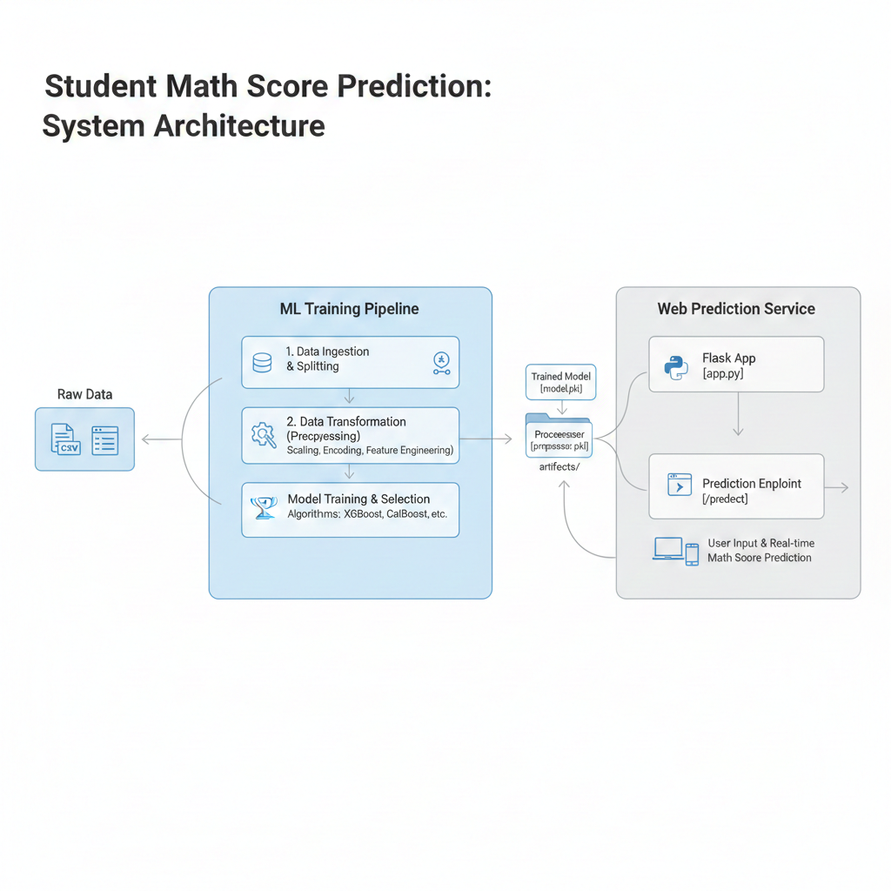

# Student Math Score Prediction Web App



## Overview
A production-grade Machine Learning regression pipeline engineered to predict student mathematical performance. This project transitions from experimental Jupyter Notebooks to a modular Python architecture, featuring automated data ingestion, transformation, and a Flask-based web interface for real-time inference.

# Table of Contents
- [Introduction](#introduction)
- [Project Structure](#project-structure)
- [Tech Stack](#tech-stack)
- [Installation](#installation)
- [Usage](#usage)
- [Modular Components](#modular-components)
- [Authors & Acknowledgements](#authors_and_acknowledgments)

## Introduction <a name="introduction"></a>
The **Math Score Prediction** system analyzes demographic and academic factors—such as parental education, ethnicity, and test preparation—to provide accurate performance forecasts. It leverages a custom-built pipeline using **Scikit-Learn**, **XGBoost**, and **CatBoost**, ensuring that data preprocessing and model scoring are handled consistently from training to deployment.

## Project Structure <a name="project-structure"></a>
```text
├── artifacts/             # Serialized models (.pkl) and processed data
├── notebook/              # Exploratory Data Analysis (EDA) and Model Research
├── src/                   # Core Source Code
│   ├── components/        # Data Ingestion, Transformation, & Model Training
│   ├── pipeline/          # Training and Prediction workflow logic
│   ├── logger.py          # Custom execution logging
│   └── exception.py       # Standardized error handling
├── templates/             # Flask HTML frontend
├── app.py                 # Flask Application Entry Point
├── requirements.txt       # Project Dependencies
└── setup.py               # Package Metadata

---

## 📦 Tech Stack

- **Language:** Python 3.8+
- **Web Framework:** Flask 
- **ML Frameworks:** Scikit-Learn, XGBoost, CatBoost
- **Logging:** Python Logging Module
- **Dev Tools:** Swagger, Git, VSCode, Linux

---

## 📖 Getting Started
## Installation <a name="installation"></a>
#### Prerequisites <a name="prerequisites"></a>
Before running this repo, ensure you have the following prerequisites installed:
- Python 3.8+

---

### 1. Clone the Repo <a name="Clone the Repo"></a>
```bash
git clone [https://github.com/Arshavin023/machine_learning_regression_webapp.git](https://github.com/Arshavin023/machine_learning_regression_webapp.git)
cd machine_learning_regression_webapp
```

### 2. Create and Activate Virtual Environment <a name="create and activate virtual environment"></a>
```bash
python3 -m venv ml_venv
source ml_venv/bin/activate  # On Windows: ml_venv\Scripts\activate
```

### 3. Install Python Packages <a name="Install the required Python packages"></a>
```bash
pip install -r requirements.txt
```

### 4. Model Training and Selection <a name="Automated ingestion, transformation, and model selection process"></a>
```bash
python3 src/components/data_ingestion.py
```

### 5. Deployment <a name="Deployment"></a>
```bash
python3 application.py
```


## License <a name="license"></a>
- MIT License